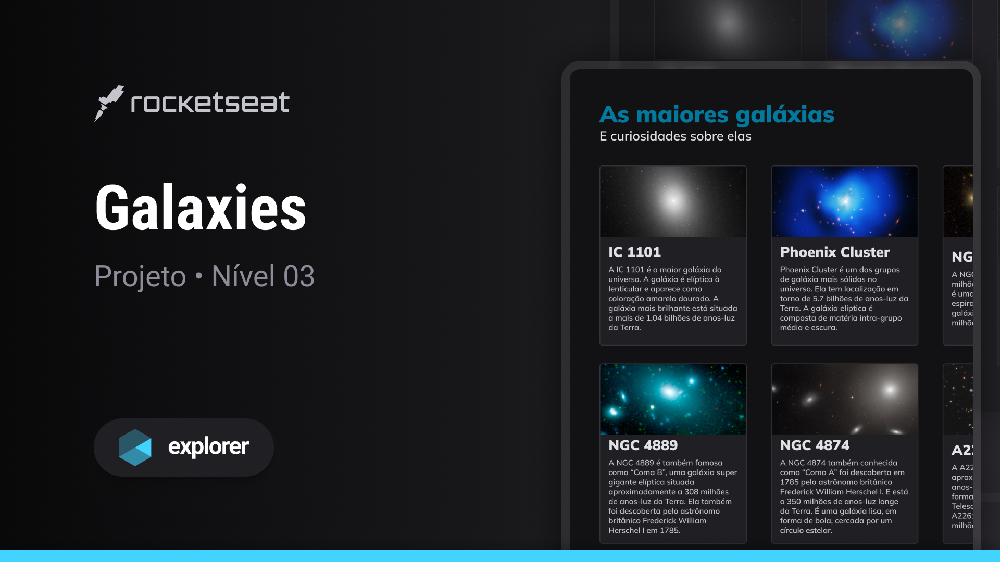

# galaxies

## Sobre o projeto

Este projeto consiste em uma interface web simples, construída como parte da trilha Explorer oferecida pela Rocketseat.
O objetivo principal é abordar conceitos fundamentais de grid. Durante as aulas, foram aplicados os seguintes conceitos:

Conceitos aplicados
* Conceitos e demonstração prática dos fundamentos do CSS Grid no código
* Propriedade `grid-template-columns`
* Propriedade `grid-template-rows`
* Propriedade `grid-column`
* Propriedade `grid-rows`
* Propriedade `grid-template-areas`
* Utilização do shorthand para simplificar a definição do template do grid

## Layout do projeto
<table>
  <tr>
    <td></td>
  </tr>   
</table>

## Tecnologias
- HTML
- CSS
- Figma
